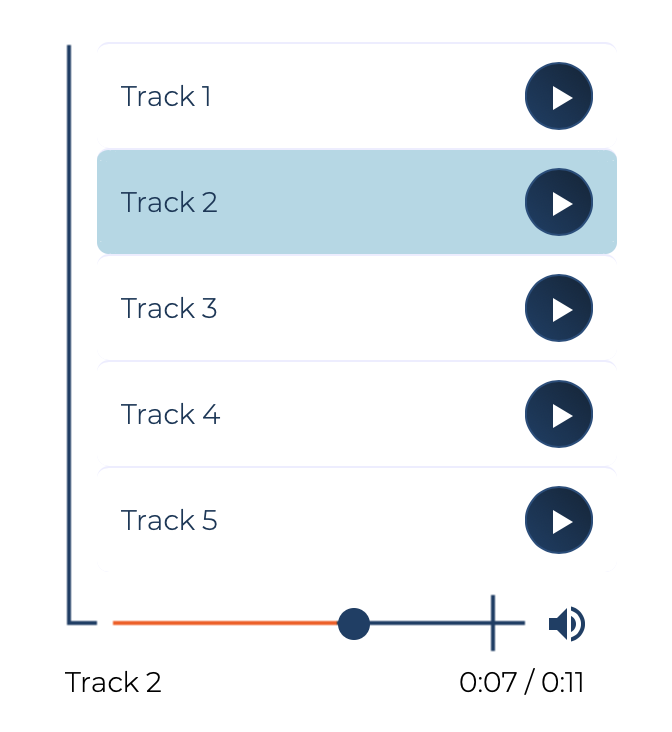

# audio-player

A custom playlist-style UI that wraps the HTML5 audio element. The player implements many of the same operations available in the built-in audio controls (e.g. click and drag seek, volume on/off, track selection), but presents them in a list with more appealing custom styles. The code is encapsulated in a web component for easy reuse.

<p align="center">
    
</p>


To include tracks in the player, add audio elements without controls in an ```<div>``` inside the web component. The ```title``` attribute indicates the title that will be shown in the rendered player and ```src``` indicates the location of the soundfile:

```html
<audio-player>
    <div>
        <audio preload="metadata" title="First track" src="./recordings/track01.wav"></audio>
        <audio preload="metadata" title="Second track" src="./recordings/track02.wav"></audio>
    </div>
</audio-player>
```
