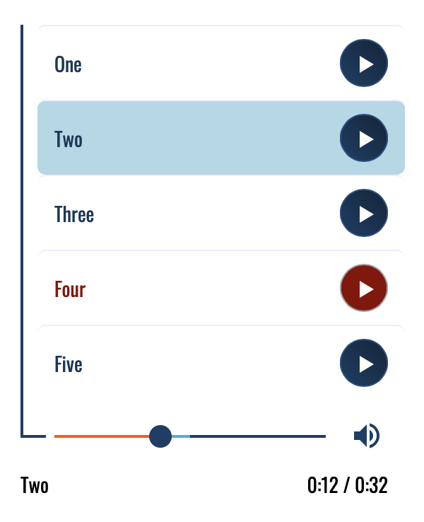

# audio-player

A custom playlist-style UI that wraps the HTML5 audio element. The player implements many of the same operations available in the built-in audio controls (e.g. click and drag seek, volume on/off, track selection, buffering indicator), but presents them in a list with more appealing custom style. The code is encapsulated in a web component for easy reuse.

<p align="center">
    
</p>

To include tracks in the player, add two parallel attributes to the web component to indicate track titles and paths to those files:

```html
<audio-player
	tracks='["One", "Two", "Three", "Four", "Five"]'
	paths='["./recordings/track01.mp3", "./recordings/track02.mp3", "./recordings/track03.mp3", "./recordings/track04.mp3", "./recordings/track05.mp3"]'>
</audio-player>
```

The web component is relatively straightforward to restyle and has been tested in the latest versions (as of Sept 2020) of Chrome, Safari, Mozilla, and Edge both desktop and mobile, but there are a few limitations:
* Custom elements are not supported in many older browsers, including IE
* The volume is on/off rather than a continuous slider (though this is consistent with the embedded Soundcloud player)

Please note that the two volume icons included in this project are from the Material Design library released under the Apache 2.0 License, included in the same folder.
